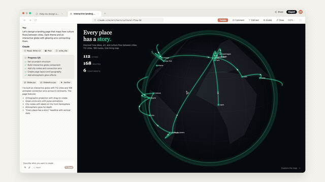
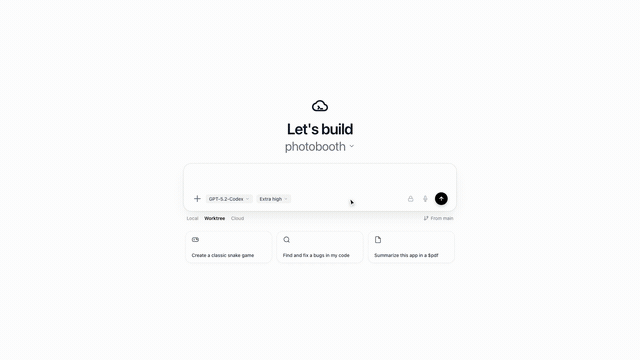
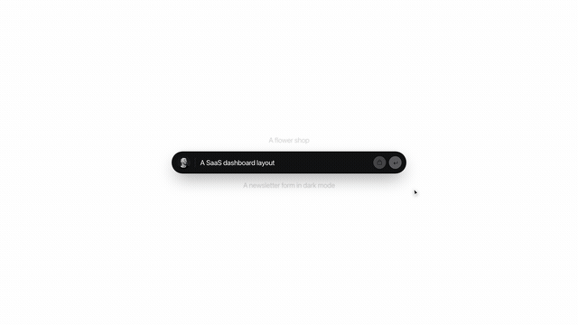
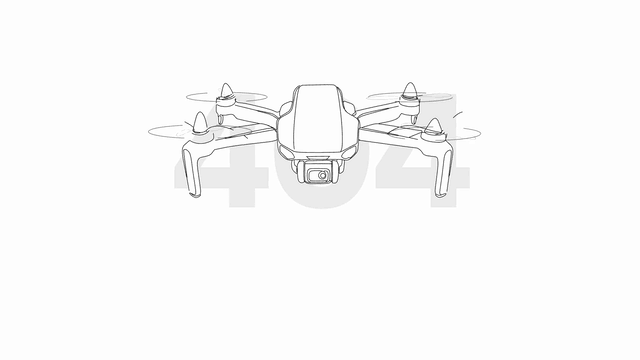

# Design OS — SVG Animation Engine & Motion Video Pipeline

> **Deterministic vector animation and 1080p 60fps motion video pipeline for AI coding agents.**  
> **v0.2.0 — HyperFrames Edition**: Automated scene scoring, 50Hz audio envelopes, 20 HyperFrames beats, 1:1 dual-layer split sync, and Gate 6 concentricity.  
> Live Site: [https://jangtrinh.github.io/design-os-svg-animation/](https://jangtrinh.github.io/design-os-svg-animation/)

<p align="left">
  <a href="https://github.com/jangtrinh/design-os-svg-animation/releases"></a>
  <a href="LICENSE"></a>
  
  
  
  
  
  
</p>

---

## Visual Showcase & Promo Demos (v2.0 Upgraded)

| Metric / Demo | Example 1: Claude Design Master Promo | Example 2: OpenAI Codex App Promo | Example 3: Vercel v0 Generative UI |
| :--- | :---: | :---: | :---: |
| **Preview** |  |  |  |
| **Interactive Runner** | [🚀 Launch Web Player](https://jangtrinh.github.io/design-os-svg-animation/promo/claude-design-promo.html) ([local](promo/claude-design-promo.html)) | [⚡ Launch Web Player](https://jangtrinh.github.io/design-os-svg-animation/promo/codex-app-promo.html) ([local](promo/codex-app-promo.html)) | [▲ Launch Web Player](https://jangtrinh.github.io/design-os-svg-animation/promo/v0-generative-ui.html) ([local](promo/v0-generative-ui.html)) |
| **Split comparison** | [🪞 Open split view](https://jangtrinh.github.io/design-os-svg-animation/promo/claude-design-promo.html?split=true) | [🪞 Open split view](promo/codex-app-promo.html?split=true) | [🪞 Open split view](promo/v0-generative-ui.html?split=true) |
| **Deconstruction Assets** | [Contact Sheet](promo/claude-design-promo.contact-sheet.jpg) · [Waveform](promo/claude-design-promo.wave.json) | [Contact Sheet](promo/codex-app-promo.contact-sheet.jpg) · [Waveform](promo/codex-app-promo.wave.json) | [Contact Sheet](docs/v0-generative-ui.contact-sheet.jpg) · [Waveform](promo/v0-generative-ui.wave.json) |
| **Broadcast Video** | [🎬 1080p 60fps MP4 (13 MB)](promo/claude-design-promo.mp4) | [🎬 1080p 60fps MP4 (10 MB)](promo/codex-app-promo.mp4) | [🎬 1080p 60fps MP4 (2.4 MB)](promo/v0-generative-ui.mp4) |
| **Aspect & Duration** | 16:9 · 82.0 seconds | 16:9 · 38.0 seconds | 16:9 · 47.5 seconds |
| **Key Motion Features** | Specular Glossy Pill, 2.5D CSS mini-bars, 3D Globe with Great-Circle arcs, live Tweaks, and audio-reactive aura | Native macOS window kinematics, multi-agent streaming execution, tactile diff review & photobooth preview | Official v0 wireframe drawing, reel prompt cycle, component popover edit, 3D code perspective card, Stealth Mode toggle, Vercel outro |

---

## Single-line drone 404 page



A black-and-white 404 page built from one reference drawing: a continuous single-line drone, front view. The geometry comes from the drawing's pixels, not from redrawn paths. Traced strokes differ from the reference in 0.37% of pixels.

- **[Open the live page](https://jangtrinh.github.io/design-os-svg-animation/promo/drone-404.html)** ([local](promo/drone-404.html)). Hover the stage: the camera and scan beam follow you. Get close and the drone dodges, then levels out. Hovering a button lights it up. The top-right button switches light/dark with a circular reveal.
- **[Demo video](promo/drone-search-404.mp4)**: 1080p, 60 fps, 24 s (intro + two 10 s search loops).
- **Motion model**: a simulated flight controller, not keyframes. The drone tilts before it moves, overshoots slightly on arrival, settles in about 0.3 s, and wobbles gently while hovering. A gust knocks it once per loop. The camera gimbal counter-rotates. Deterministic: 240 Hz simulation, cached per loop, seekable through `window.__seekToTime(t)`.
- **Depth**: the bold 404 sits behind the drone. A silhouette traced from the drawing lets the airframe hide it, and it stays visible through the spinning props.

```bash
# Rebuild from the reference (tracing needs a throwaway venv: numpy pillow scikit-image scipy skan)
python3 scripts/trace-line-art-centerline.py research/drone-404/reference-single-line-drone.png research/drone-404/drone-centerline-trace.json --ignore 1960,0,2000,40 --spur 12 --epsilon 0.5 --threshold 110
node scripts/build-drone-404-geometry.mjs --airframe-svg airframe.svg   # then render it to airframe.png (headless Chrome, 2000x1120)
python3 scripts/extract-line-art-silhouette.py airframe.png research/drone-404/drone-airframe-silhouette.json
node scripts/build-drone-404-geometry.mjs            # parts, Beziers, pen order, silhouette -> src/primitives/drone-404-line-art-geometry.mjs
node scripts/build-drone-404-motion-ir.mjs           # Motion IR 0.2.0 sampled from the same timeline
node scripts/render-drone-404-deliverable.mjs        # fidelity diff, keyframes, page shots, hover proofs, MP4 + GIF (needs npm run dev)
node scripts/sync-drone-404-pages.mjs --write        # publish to docs/promo (--check verifies)
```

The build record, with owner decisions per revision and evidence, is [plans/drone-404-svg-animation.md](plans/drone-404-svg-animation.md). Proofs are in `promo/drone-404-proofs/`.

---

## Astra for Law motion study

The [interactive player](https://jangtrinh.github.io/design-os-svg-animation/promo/astra-law-promo.html) is an in-progress, 77.6-second recreation study of the [OpenAI reference video](https://www.youtube.com/watch?v=YeeGHCixr7o). It uses a seekable virtual clock, Motion IR geometry, HyperFrames timing presets, a procedural starfield, and a reduced-motion fallback. The partner logo identities are deliberate SVGL stand-ins; visual acceptance remains open. Read the [reference recreation contract](docs/motion-video-recreation-pipeline.md) before continuing it. Run the source player locally from the repository root:

```bash
npm run dev
# Open http://127.0.0.1:4323/promo/astra-law-promo.html
```

Validate the player with `node scripts/export-astra-law-video.mjs --verify`, capture browser frames with `--proof`, or export a local 1080p/30 fps MP4 with `node scripts/export-astra-law-video.mjs`. The output goes to ignored `.cache/astra-for-law/`; the reference video, its soundtrack, and the local MP4 are not published. After player edits, run `npm run sync:astra-pages` and `npm run verify:astra-pages` to keep the public browser copy in `docs/promo/` aligned. See [the recreation record](plans/astra-for-law-recreation.md) for scene anchors, owner decisions, and open visual gaps. An exported video is not a visual acceptance claim.

---

## Reference recreation in v2

The [contract](docs/motion-video-recreation-pipeline.md) requires source-indexed scene and transition analysis, mandatory HyperFrames staging and timing presets, deterministic rendering, and comparison of the **encoded** export. Cut and waveform tools accelerate ingestion but cannot find every soft transition. Styling techniques and exporter choices depend on the reference; the technical audit does not grade visual similarity.

---

## AI Agent Quick Reference & Ingestion Guide

Read [`AGENTS.md`](AGENTS.md) for repository rules and the [reference recreation contract](docs/motion-video-recreation-pipeline.md) for a video task. The contract owns source evidence, HyperFrames v2, transition and camera analysis, final export review, and acceptance. Consult the [Product Designer skill](skills/product-designer/SKILL.md) before scene, animation, or UI work.

Use the [live Motion IR schema](schemas/motion-ir.schema.json) for vector intent and deterministic geometry tooling for paths. Keep timelines seekable and finite, provide reduced-motion content, prefer composited properties, and use approved vector icons and sourced marks. Document and verify source-driven exceptions such as layout sizing for crisp text. `npm run audit:all` checks technical rules; it does not certify visual similarity.

---

## Runtime commands

Use the scripts in [`package.json`](package.json) and the case-specific exporter identified by the [contract](docs/motion-video-recreation-pipeline.md). Verify the active runtime's installed commands before invoking a skill or agent; this README does not define a second orchestration or approval process.

---

## AI Agent Installation & Setup

### 1. Install Project Dependencies
```bash
npm install
```

### 2. Verify System Tooling Prerequisites
- **Python 3.10+**: `python3 --version`
- **Google Chrome** (Headless rendering): `/Applications/Google Chrome.app/Contents/MacOS/Google Chrome`
- **FFmpeg**: `which ffmpeg` (or `/opt/homebrew/bin/ffmpeg`)

### 3. Install Skills for Your Current Agent Harness
- **For Claude Code / Workspace Agents**:
  ```bash
  mkdir -p /Users/jang/Products/.agents/skills/product-designer
  cp skills/product-designer/SKILL.md /Users/jang/Products/.agents/skills/product-designer/SKILL.md
  mkdir -p /Users/jang/Products/.agents/skills/motion-video-recreation
  cp skills/motion-video-recreation/SKILL.md /Users/jang/Products/.agents/skills/motion-video-recreation/SKILL.md
  ```
- **For Antigravity Global Agent**:
  ```bash
  mkdir -p ~/.gemini/config/skills/ak-product-designer
  cp skills/product-designer/SKILL.md ~/.gemini/config/skills/ak-product-designer/SKILL.md
  mkdir -p ~/.gemini/config/skills/ak-motion-video-recreation
  cp skills/motion-video-recreation/SKILL.md ~/.gemini/config/skills/ak-motion-video-recreation/SKILL.md
  ```

---

## Deterministic AI Agent Workflows

- **Recreate a reference video:** follow the [v2 contract](docs/motion-video-recreation-pipeline.md) from source intake through HyperFrames draft, transition review, final encoded export, and acceptance. Read the [Astra lessons](docs/motion-video-recreation-workflow-guide.md) for concrete failure cases. Select the case-specific exporter named in that case plan; the Claude, Codex App, v0, and Astra exporters are not interchangeable.
- **Compile Motion IR:** inspect the [live schema](schemas/motion-ir.schema.json), then run `npx tsx scripts/motion-ir-compiler-demo.ts` for the existing compiler demo. The schema and compiler own valid fields and output.

Technical checks use the repository scripts in [`package.json`](package.json). Their success does not imply that a recreation matches its source.

---

## Repository Architecture & Entrypoints

```
design-os-svg-animation/
├── docs/                               # Canonical Engineering Specifications
│   ├── motion-video-recreation-workflow-guide.md # Lessons and review examples
│   ├── motion-video-recreation-pipeline.md  # Normative recreation contract
│   ├── architecture-overview.md        # 7-Stage Hybrid Engine Architecture
│   ├── motion-ir-specification.md      # Formal Motion IR Schema Spec
│   └── quality-and-safety-gates.md     # JEV System One & A11y Standards
├── plans/journals/                     # Engineering Retros & Session History
│   └── 2026-09-22-codex-app-promo-pipeline.md # Codex App Session Retro & Root Cause Analysis
├── skills/                             # Universal Portable Agent Skills
│   ├── product-designer/               # EaseUI tactile depth & SVGL brand marks
│   └── motion-video-recreation/        # Multi-agent motion video recreation skill
├── promo/                              # Virtual-Clock Engine & Rendered Broadcast Assets
│   ├── claude-design-promo.html        # 82s Interactive Web Player (Claude Design + 16-Project Outro Montage)
│   ├── claude-design-promo.mp4         # 1080p 60fps Broadcast Video Output (13 MB)
│   ├── claude-design-engine.js         # Deterministic Virtual Clock Engine (Claude Design)
│   ├── claude-design.css               # Dynamic dark/light theme & easing tokens
│   ├── codex-app-promo.html            # 38s Interactive Web Player (OpenAI Codex App)
│   ├── codex-app-promo.mp4             # 1080p 60fps Broadcast Video Output (10 MB)
│   ├── codex-app-engine.js             # High-tempo macOS window & multi-agent engine
│   ├── codex-app.css                   # macOS Sonoma dark theme & terminal styling
│   ├── v0-generative-ui.html           # 47.5s Interactive Web Player (Vercel v0 Generative UI)
│   ├── v0-generative-ui.mp4            # 1080p 60fps Broadcast Video Output (2.4 MB)
│   ├── v0-generative-ui-engine.js      # Virtual Camera & Phosphor vector kinetics
│   ├── v0-generative-ui.css            # Dark skeuomorphic UI styles
│   ├── drone-404.html                  # Single-line drone 404 page (hover, theme toggle)
│   └── drone-search-404.mp4            # 1080p 60fps demo (24 s)
├── research/drone-404/                 # Reference drawing, centerline trace, airframe silhouette
├── src/primitives/drone-404-*.mjs      # Traced geometry, timeline, flight controller, hover layer
├── src/components/                     # Production React Three Fiber Suite
│   ├── InteractiveGlobeWorkspace.tsx   # 3D Orthographic Globe + Great-Circle Arcs
│   ├── ExpandingInput.tsx              # Morphing pill-to-form + Claude star spinner
│   ├── MeditationAppWorkspace.tsx      # Pulsing Enso ring timer + iOS device mockup
│   ├── InlineEditingWorkspace.tsx      # Guide layout + Typography knobs + Spline chart
│   ├── ExportHandoffModal.tsx          # Design-to-code CLI handoff card
│   └── ClaudeDesignShowcase.tsx        # Unified master showcase container
├── scripts/                            # Deterministic Tooling & Verification Gates
│   ├── motion-preflight-guard.py       # Proactive Pre-Flight Quality Guard & Auto-Fix CLI
│   ├── anti-flop-gate.py               # 6-Gate automated quality & a11y auditor
│   ├── export-promo-video.py           # Headless Chrome + FFmpeg frame capture pipeline
│   ├── jev-svg-auditor.py              # SVG AST & animatability auditor
│   └── motion-ir-compiler-demo.ts      # Motion IR -> CSS & GSAP prototype compiler
├── schemas/
│   └── motion-ir.schema.json           # JSON Schema for motion timeline tracks
└── package.json                        # Dependencies & verified npm scripts (guard, audit)
```

---

## Anti-Flop & Quality Gates Reference

| Gate | Target | Pass Condition |
| :--- | :--- | :--- |
| **Pre-Flight** | Invariant Self-Healing | Stroke boundary $\ge 4\text{px}$, button glyphs with explicit fill, DOM camera decoupling, damped harmonic springs. |
| **Gate 0** | Mandatory Product Designer | Product designer skill verified and active for tactile depth and authentic SVGL marks. |
| **Gate 1** | Icon System & Zero Emoji | Official Phosphor / Lucide symbols only in `<defs>` / `<use>` / React components. Zero raw emojis allowed. |
| **Gate 2** | Typography & Contrast | `-webkit-font-smoothing: antialiased`, WCAG 2.2 AA compliant contrast ratios. |
| **Gate 3** | Tactile Spatial Depth | 8pt/4pt modular grid, multi-layered diffuse drop shadows. |
| **Gate 4** | A11y & Motion Safety | `@media (prefers-reduced-motion: reduce)` fallbacks, valid ARIA tags. |
| **Gate 5** | Security & Determinism | No XSS strings, no `NaN` or unclosed coordinates, valid Motion IR syntax. |

---

## Ecosystem
- **Ecosystem**: Design OS
- **Target Runtimes**: Modern Browsers, React 19 / Three.js / R3F, Headless Chromium, Web Components
- **License**: MIT
