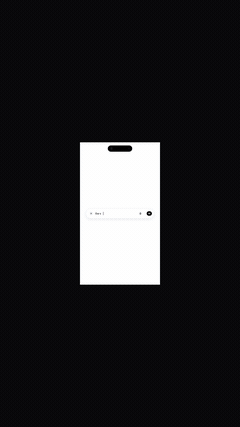

# Design OS — SVG Animation Engine & Motion Video Pipeline

> **AI-AGENT-FIRST RUNBOOK**: This repository is engineered for autonomous AI agents (Claude Code, Codex Native, Antigravity) to design, compile, verify, and render production-grade vector animations and high-fidelity launch promo videos.

---

## 📺 Visual Showcase & 5s Demos

| Example 1: Claude Design 3D Globe & Tweaks (16:9) | Example 2: SaaS 9:16 Vector Motion Short |
| :---: | :---: |
|  |  |
| *Orthographic 3D Globe with glowing arcs & live Tweaks panel* | *Shared-element morph, Phosphor icons & kinetic typography* |

---

## 🤖 AI Agent Quick Reference & Ingestion Guide

If you are an AI coding agent reading this codebase, follow these rules and directives strictly:

### 1. The 5 Immutable Agent Invariants
1. **Never generate raw SVG path animations directly**: Always pass through the [Motion IR Schema](file:///Users/jang/Products/design-os-svg-animation/schemas/motion-ir.schema.json) and deterministic geometric compilation (`svgo`, `flubber`).
2. **Deterministic First**: Decouple temporal progression via the Virtual Clock (`window.__seekToTime(t)`). Never rely on non-deterministic real-time screen recordings.
3. **GPU-Composited Transforms Only**: Animate `transform` (`translate3d`, `scale`, `rotate`) and `opacity`. Strictly avoid animating layout-thrashing attributes (`width`, `height`, `top`, `left`, `d`) during continuous motion.
4. **Mandatory A11y & Reduced Motion**: Every generated CSS/JS animation must provide `@media (prefers-reduced-motion: reduce)` fallbacks.
5. **Zero Design Flop**: Generated assets and videos must pass all 5 verification gates via `python3 scripts/anti-flop-gate.py` with exit code `0`.

---

## 🛠️ Multi-Agent Runtime Commands & Mappings

| Action | Claude Code (`.claude`) | Codex Native (`Codex CLI`) | Antigravity (`Gemini Agentic`) |
| :--- | :--- | :--- | :--- |
| **Activate Skill** | `/motion-video-recreation` | Prompt task referenced in `AGENTS.md` | `ak:motion-video-recreation` |
| **Verify Anti-Flop** | `bash: python3 scripts/anti-flop-gate.py` | `shell: python3 scripts/anti-flop-gate.py` | `run_command: python3 scripts/anti-flop-gate.py` |
| **Export MP4 Video**| `bash: python3 scripts/export-promo-video.py` | `shell: python3 scripts/export-promo-video.py` | `run_command: python3 scripts/export-promo-video.py` |
| **Compile Motion IR**| `bash: npx tsx scripts/motion-ir-compiler-demo.ts` | `shell: npx tsx scripts/motion-ir-compiler-demo.ts` | `run_command: npx tsx scripts/motion-ir-compiler-demo.ts` |
| **Audit SVGs / AST**| `bash: python3 scripts/jev-svg-auditor.py` | `shell: python3 scripts/jev-svg-auditor.py` | `run_command: python3 scripts/jev-svg-auditor.py` |

---

## 📦 AI Agent Installation & Setup

### 1. Install Project Dependencies
```bash
npm install
```

### 2. Verify System Tooling Prerequisites
- **Python 3.10+**: `python3 --version`
- **Google Chrome** (Headless rendering): `/Applications/Google Chrome.app/Contents/MacOS/Google Chrome`
- **FFmpeg**: `which ffmpeg` (or `/opt/homebrew/bin/ffmpeg`)

### 3. Install Skill for Your Current Agent Harness
- **For Claude Code / Workspace Agents**:
  ```bash
  mkdir -p /Users/jang/Products/.agents/skills/motion-video-recreation
  cp skills/motion-video-recreation/SKILL.md /Users/jang/Products/.agents/skills/motion-video-recreation/SKILL.md
  ```
- **For Antigravity Global Agent**:
  ```bash
  mkdir -p ~/.gemini/config/skills/ak-motion-video-recreation
  cp skills/motion-video-recreation/SKILL.md ~/.gemini/config/skills/ak-motion-video-recreation/SKILL.md
  ```

---

## 🚀 Deterministic AI Agent Workflows

### Workflow A: Recreating Promo Video with 99% Parity
1. **Start Virtual-Clock Local Server**:
   ```bash
   python3 -m http.server 3033 --directory ./promo &
   ```
2. **Capture Deterministic Frames & Assemble Broadcast MP4**:
   ```bash
   python3 scripts/export-promo-video.py
   # Output: promo/claude-design-promo.mp4 (1080p 60fps, CRF 18)
   ```
3. **Run 5-Gate Anti-Flop Audit**:
   ```bash
   python3 scripts/anti-flop-gate.py
   # Exit code must be 0
   ```

### Workflow B: Compiling Motion IR to Production Code
1. Inspect or modify animation storyboard: `fixtures/saas-short.motion.json`.
2. Compile to pure CSS keyframes & GSAP timeline:
   ```bash
   npx tsx scripts/motion-ir-compiler-demo.ts
   ```

---

## 🏛️ Repository Architecture & Entrypoints

```
design-os-svg-animation/
├── docs/                               # Canonical Engineering Specifications
│   ├── motion-video-recreation-pipeline.md  # 5-Stage Universal Motion Pipeline
│   ├── architecture-overview.md        # 7-Stage Hybrid Engine Architecture
│   ├── motion-ir-specification.md      # Formal Motion IR Schema Spec
│   └── quality-and-safety-gates.md     # JEV System One & A11y Standards
├── skills/                             # Universal Portable Agent Skills
│   └── motion-video-recreation/
│       └── SKILL.md                    # Multi-agent skill definition
├── promo/                              # Virtual-Clock Engine & Rendered Assets
│   ├── claude-design-promo.html        # 82s Standalone Interactive Web Player
│   ├── claude-design-promo.mp4         # 1080p 60fps Broadcast Video Output
│   ├── claude-design-engine.js         # Deterministic Virtual Clock Engine
│   └── claude-design.css               # Dynamic dark/light theme & easing tokens
├── src/components/                     # Production React Three Fiber Suite
│   ├── InteractiveGlobeWorkspace.tsx   # 3D Orthographic Globe + Great-Circle Arcs
│   ├── ExpandingInput.tsx              # Morphing pill-to-form + Claude star spinner
│   ├── MeditationAppWorkspace.tsx      # Pulsing Enso ring timer + iOS device mockup
│   ├── InlineEditingWorkspace.tsx      # Guide layout + Typography knobs + Spline chart
│   ├── ExportHandoffModal.tsx          # Design-to-code CLI handoff card
│   └── ClaudeDesignShowcase.tsx        # Unified master showcase container
├── scripts/                            # Deterministic Tooling & Verification Gates
│   ├── anti-flop-gate.py               # 5-Gate automated quality & a11y auditor
│   ├── export-promo-video.py           # Headless Chrome + FFmpeg frame capture pipeline
│   ├── jev-svg-auditor.py              # SVG AST & animatability auditor
│   └── motion-ir-compiler-demo.ts      # Motion IR -> CSS & GSAP prototype compiler
├── schemas/
│   └── motion-ir.schema.json           # JSON Schema for motion timeline tracks
└── package.json                        # Dependencies (three, @react-three/fiber, lucide-react)
```

---

## 🛡️ Anti-Flop Automated Gates Reference

| Gate | Target | Pass Condition |
| :--- | :--- | :--- |
| **Gate 1** | Icon System | Official Phosphor / Lucide symbols only in `<defs>` / `<use>`. No manual hack paths. |
| **Gate 2** | Typography & Contrast | `-webkit-font-smoothing: antialiased`, WCAG 2.2 AA compliant contrast ratios. |
| **Gate 3** | Tactile Spatial Depth | 8pt/4pt modular grid, multi-layered diffuse drop shadows. |
| **Gate 4** | A11y & Motion Safety | `@media (prefers-reduced-motion: reduce)` fallbacks, valid ARIA tags. |
| **Gate 5** | Security & Determinism | No XSS strings, no `NaN` or unclosed coordinates, valid Motion IR syntax. |

---

## 🤝 Ecosystem
- **Ecosystem**: Design OS
- **Target Runtimes**: Modern Browsers, React 19 / Three.js / R3F, Headless Chromium, Web Components
- **License**: MIT
