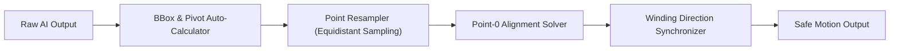

# Đánh Giá Năng Lực AI & Kỹ Thuật Deterministic Repair Trong SVG Animation

Khảo sát toàn diện về ranh giới năng lực của Mô hình ngôn ngữ lớn (LLM/VLM) trong đồ họa vector chuyển động, các điểm gãy (failure modes) điển hình và giải pháp sửa lỗi tự động bằng thuật toán tất định (Deterministic Repair).

---

## 1. Bản Đồ Năng Lực AI (AI Capabilities vs Limitations)

| Nhiệm Vụ (Task) | Năng Lực AI (LLM / VLM) | Trạng Thái | Giải Pháp Kiến Trúc |
| :--- | :--- | :--- | :--- |
| **Phân tích ngữ nghĩa ý định** (Intent Parsing) | **Xuất sắc**: Hiểu rõ "nảy tưng tưng", "chuyển động nhẹ nhàng", "rung chuông cảnh báo". | ✅ Tốt | Dùng LLM trích xuất `intent.json`. |
| **Phân rã Scene Graph & Gán nhãn** (Semantic Tagging) | **Rất tốt**: Nhận biết đâu là cánh tay, bánh xe, mặt trời, bóng đổ trong SVG. | ✅ Tốt | Dùng VLM + DOM Parser định danh node. |
| **Chọn Easing & Timing Token** | **Tốt**: Map được cảm xúc sang đường cong Bezier chuẩn (`cubic-bezier`). | ✅ Tốt | Sử dụng Preset Token Library. |
| **Sinh trực tiếp mã đường cong Bézier** (\(C, S, Q\)) | **Rất kém**: Bị ảo giác tọa độ (Coordinate Hallucination), nát hình, không khớp tiếp tuyến. | ❌ Thất bại | **Cấm LLM tính toán tọa độ Bézier**. |
| **Nội suy đỉnh cho Morphing** (Point Resampling) | **Thất bại hoàn toàn**: Không thể đếm và căn chỉnh chính xác 100+ đỉnh giữa 2 shape. | ❌ Thất bại | **Dùng Flubber / Polymorph Engine**. |
| **Tối ưu hóa hiệu năng DOM / GPU** | **Kém**: Thường sinh code animate trực tiếp `x, y, width, height` gây lag render. | ❌ Thất bại | **AST Linter & CSS Transform Compiler**. |

---

## 2. Các Điểm Gãy Điển Hình (Failure Modes) Của AI

### 2.1 Điểm Gãy 1: Ảo Giác Tọa Độ Không Gian (Spatial Coordinate Hallucination)
- **Hiện tượng**: Khi yêu cầu LLM "Vẽ một ngôi sao rồi animate nó xoay quanh tâm", LLM thường tính sai `transform-origin` hoặc sinh các điểm tọa độ vượt quá biên giới hạn `viewBox` (ví dụ `viewBox="0 0 100 100"` nhưng điểm vẽ là `x=250`).
- **Nguyên nhân**: Tokenizer của LLM chia số thành các mảnh token (ví dụ `145.8` bị chia thành `14`, `5`, `.`, `8`), khiến mô hình không có trực giác toán học liên tục về không gian Euclide 2D.

### 2.2 Điểm Gãy 2: Lệch Số Lượng Đỉnh Khi Morphing (Topology & Vertex Mismatch)
- **Hiện tượng**: Biến đổi từ hình vuông (4 đỉnh) sang hình tròn (hàng chục hoặc vô số điểm). LLM sinh 2 chuỗi lệnh `d="..."` với số lượng điểm khác nhau. Trình duyệt không thể nội suy bằng CSS `d: path(...)` và ném lỗi crash animation.
- **Nguyên nhân**: Toán học nội suy đường cong đòi hỏi ánh xạ song ánh \(f: V_A \to V_B\).

### 2.3 Điểm Gãy 3: Singularities & Xoắn Đường Cong (Self-Intersection / Inversion)
- **Hiện tượng**: Hai hình tròn morphing sang nhau nhưng điểm bắt đầu (\(P_0\)) ở góc 12 giờ trên hình A và góc 6 giờ trên hình B. Kết quả là hình tròn bị xoắn chéo 180 độ ở frame giữa.

---

## 3. Cơ Chế Deterministic Repair (Sửa Lỗi Tự Động Tất Định)

Để khắc phục các điểm gãy trên, hệ thống triển khai một bộ lọc sửa lỗi tự động trước khi xuất code:

1. **Auto-Pivot Computation**:
   Thay vì tin vào điểm xoay LLM gợi ý, engine tính toán trọng tâm hình học (Centroid) hoặc bounding box chuẩn:
   \[
   C_x = \frac{x_{\min} + x_{\max}}{2}, \quad C_y = \frac{y_{\min} + y_{\max}}{2}
   \]
2. **Equidistant Cubic Bézier Resampling**:
   Sử dụng thư viện hình học (`flubber` hoặc `paper.js`) để chia lại cả 2 đường path thành đúng \(N\) đoạn Bézier có độ dài cung (arc length) xấp xỉ nhau:
   \[
   N = \max(\text{segments}(A), \text{segments}(B), 32)
   \]
3. **Minimum Distance Point-0 Alignment**:
   Duyệt qua các điểm bắt đầu khả dĩ của Path B và chọn vị trí xuất phát tối thiểu hóa tổng bình phương khoảng cách Ơ-clit giữa các cặp điểm:
   \[
   k^* = \arg\min_k \sum_{i=1}^N \| A_i - B_{(i+k) \pmod N} \|^2
   \]
4. **Winding Normalization**:
   Kiểm tra dấu diện tích đa giác có hướng qua định lý Green:
   \[
   \text{Area} = \frac{1}{2} \sum_{i=0}^{N-1} (x_i y_{i+1} - x_{i+1} y_i)
   \]
   Nếu \(\text{Area}(A) \cdot \text{Area}(B) < 0\) (ngược chiều quay), tự động đảo ngược thứ tự đỉnh của Path B.
