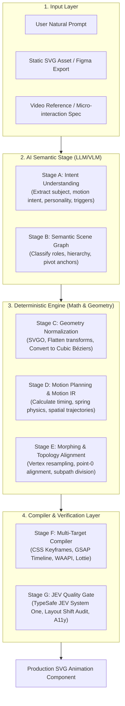

# Tổng Quan Kiến Trúc Engine: 7-Stage Hybrid Pipeline

Hệ thống **`design-os-svg-animation`** được thiết kế dựa trên nguyên lý cốt lõi: **Hybrid Decoupling**. Chúng ta tách rời hoàn toàn quá trình sinh ý định chuyển động bằng AI (Stochastic) khỏi khâu tính toán hình học và biên dịch code chuyển động (Deterministic).

---

## 1. Sơ Đồ Kiến Trúc Tổng Thể

---

## 2. Chi Tiết 7 Giai Đoạn

### Stage A: Intent Understanding (Hiểu Ý Định Ngữ Nghĩa)
- **Actor**: LLM / VLM (GPT-4o, Claude 3.5 Sonnet, Gemini 1.5 Pro).
- **Trách nhiệm**: Đọc hiểu yêu cầu từ văn bản hoặc hình ảnh tham chiếu, bóc tách các tham số chuyển động bậc cao:
  - `subject`: Đối tượng chính cần animate (icon, button, character, banner).
  - `action`: Hành vi chuyển động (`attention`, `feedback`, `transition`, `ambient_loop`).
  - `personality`: Sắc thái (`bouncy`, `snappy`, `fluid`, `mechanical`, `playful`).
  - `trigger`: Điều kiện kích hoạt (`hover`, `click`, `scroll`, `viewport_enter`, `auto_loop`).
  - `constraints`: Ràng buộc (`duration_ms`, `preserve_aspect_ratio`, `reduced_motion_fallback`).

### Stage B: Semantic Scene Graph (Cây Ngữ Nghĩa Cảnh SVG)
- **Actor**: Parser + VLM Semantic Classifier.
- **Trách nhiệm**: Phân tích cây DOM của file SVG thô thành Semantic Scene Graph:
  - Gán nhãn ngữ nghĩa cho các node: `layer-background`, `body-primary`, `accent-highlight`, `anchor-pivot`.
  - Tự động suy luận điểm xoay (Pivot Point / Transform Origin): Ví dụ chuông xoay quanh đỉnh trên, cánh quạt xoay quanh tâm hình học.

### Stage C: Geometry Normalization (Chuẩn Hóa Hình Học Tất Định)
- **Actor**: Deterministic Engine (SVGO, Paper.js, Custom AST Transforms).
- **Nhiệm vụ**:
  1. Chuẩn hóa `viewBox` về tọa độ chuẩn (ví dụ `0 0 100 100` hoặc giữ nguyên tỉ lệ nguyên bản).
  2. Làm phẳng các ma trận biến đổi lồng nhau (`transform: matrix(...)`).
  3. Chuyển đổi mọi primitive (`<rect>`, `<circle>`, `<polygon>`) thành `<path>`.
  4. Đưa mọi lệnh path (`Q`, `S`, `T`, `A`) về chuẩn Cubic Bézier (`C`).
  5. Đồng nhất chiều quay của đường cong (Winding order).

### Stage D: Motion Planning & Motion IR
- **Actor**: Motion Planner & Kinematics Solver.
- **Trách nhiệm**: Sinh cấu trúc dữ liệu trung gian **Motion IR** (Intermediate Representation):
  - Định nghĩa các đường chuyển động (Motion Tracks): `translate`, `rotate`, `scale`, `opacity`, `morph`.
  - Thiết lập hàm chuyển động (Easing): Spring Physics (\(m \cdot \ddot{x} + c \cdot \dot{x} + k \cdot x = 0\)) hoặc Cubic Bézier (`cubic-bezier(0.34, 1.56, 0.64, 1)`).
  - Điều phối độ trễ (Stagger offsets).

### Stage E: Morphing & Topology Alignment
- **Actor**: Morphing Engine (Flubber, Polymorph, Delaunay Triangulation).
- **Nhiệm vụ**:
  1. Khi cần biến đổi hình dạng (Morphing giữa Path A và Path B), kiểm tra số lượng đỉnh.
  2. Bổ sung các đỉnh nội suy giả (Resampling) sao cho số segment Bézier giữa 2 path khớp chính xác 1:1.
  3. Tìm điểm xuất phát tối ưu (\(P_0\)) để đường cong biến đổi không bị xoắn tự thân (Self-intersection).

### Stage F: Multi-Target Compiler (Biên Dịch Đa Nền Tảng)
- **Actor**: Code Generators.
- **Biên dịch Motion IR sang**:
  1. **Pure CSS**: Cho các micro-interactions siêu nhẹ, zero JavaScript runtime, GPU-accelerated.
  2. **GSAP Timeline**: Cho các chuỗi animation phức tạp, cần timeline control (`pause`, `reverse`, `seek`), SVG path morphing phức tạp.
  3. **Web Animations API (WAAPI)**: Cho chuẩn web native linh hoạt, hiệu năng cao, can thiệp bằng JS mà không cần thư viện bên thứ ba.
  4. **Lottie SVG**: Cho các ứng dụng mobile hoặc cross-platform export.

### Stage G: JEV Quality Gate & Verification
- **Actor**: TypeSafe JEV System One + Headless Browser Test Runner.
- **Tiêu chuẩn kiểm duyệt**:
  - Chấm điểm độ sâu và tính khả thi vật lý (Rigor Score >= 2.5/3.0).
  - Quét lỗi cú pháp, NaN viewBox, overflow bounds.
  - Kiểm tra điều kiện giảm tải chuyển động (`prefers-reduced-motion`).
  - Đo lường Frame Rate (60fps / 120fps), đảm bảo không gây Layout Shift (CLS).
