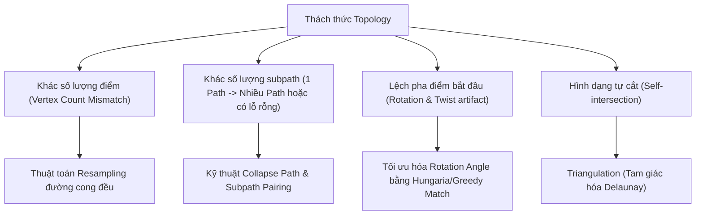

# Chiến Lược Xử Lý Topology & Morphing Đồ Họa Vector

Tài liệu hướng dẫn kỹ thuật chuyên sâu về thuật toán biến đổi hình dạng (Vector Path Morphing) trong môi trường SVG, giải quyết bài toán phức tạp nhất trong hoạt hình vector.

---

## 1. Bản Chất Toán Học Của Morphing

Một đường cong Bézier bậc ba (Cubic Bézier) được biểu diễn bởi 4 điểm điều khiển:
\[
B(t) = (1-t)^3 P_0 + 3(1-t)^2 t P_1 + 3(1-t) t^2 P_2 + t^3 P_3, \quad t \in [0, 1]
\]

Để nội suy mượt mà giữa hai đường cong \(A(t)\) và \(B(t)\) theo thời gian \(\tau \in [0, 1]\):
\[
C(t, \tau) = (1 - \tau) A(t) + \tau B(t)
\]
Điều kiện tiên quyết: Đường cong \(A\) và \(B\) phải có cùng cấu trúc và cùng số lượng segment.

---

## 2. Các Thách Thức Topology & Giải Pháp

### 2.1 Giải Pháp Cho Trường Hợp 1 Shape -> Nhiều Shape (Subpath Splitting)
Khi biến đổi từ 1 hình tròn sang 3 ngôi sao:
1. **Ghost Subpaths**: Tạo ra 2 hình tròn tàng hình (opacity = 0, scale = 0) tại tâm của hình tròn mẹ.
2. Ghép cặp (Pairing): Cặp 1-1 giữa (Hình tròn gốc -> Ngôi sao 1), (Hình tròn ảo 1 -> Ngôi sao 2), (Hình tròn ảo 2 -> Ngôi sao 3).
3. Nội suy đồng thời cả hình học và opacity.

### 2.2 Đánh Giá Các Thư Viện Hiện Hành
- **Flubber (Recommended for 2D UI)**: Thư viện chuẩn mực nhất cho morphing giữa các path SVG tùy ý. Xử lý tự động việc bổ sung điểm và chia tách subpaths.
- **GSAP MorphSVGPlugin**: Rất mạnh mẽ nhưng là sản phẩm thương mại có phí (Club GSAP), khó đóng gói vào thư viện open-source.
- **Polymorph.js**: Khá linh hoạt nhưng ít bảo trì hơn Flubber.
- **Paper.js**: Lý tưởng cho các thao tác Boolean (Union, Subtract, Intersect) trước khi animate.
