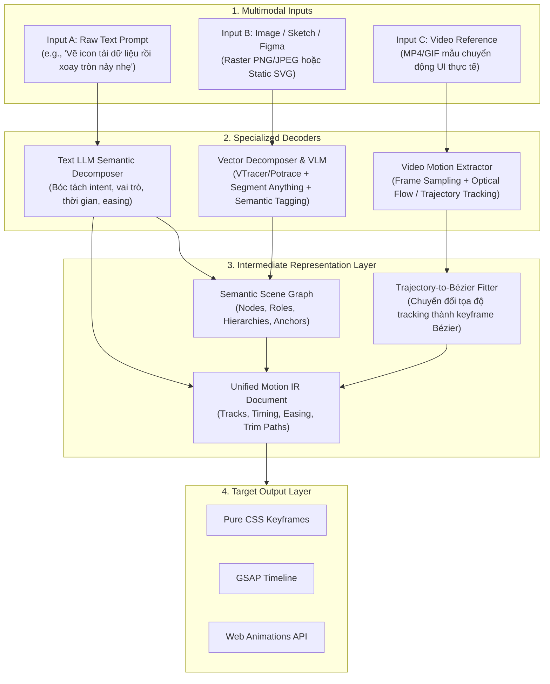

# Kiến Trúc Multimodal Ingestion Pipeline (Text, Image, Video to SVG Motion)

Tài liệu thiết kế kiến trúc tiếp nhận và xử lý đa phương thức (Multimodal Ingestion) cho hệ thống **`design-os-svg-animation`**. Hệ thống hỗ trợ 3 dạng đầu vào linh hoạt: **Raw Text Prompt**, **Hình ảnh / Sketch / Figma Asset**, và **Video Motion Reference**.

---

## 1. Sơ Đồ Khối Xử Lý Đa Phương Thức

---

## 2. Chi Tiết Từng Luồng Xử Lý Đầu Vào

### Luồng A: Raw Text Prompt (Văn Bản Thuần)
- **Đặc điểm**: Đầu vào phổ biến nhất từ người dùng (ngôn ngữ tự nhiên).
- **Quy trình xử lý**:
  1. **Intent Extraction**: LLM phân tích văn bản để xác định:
     - Đối tượng (`subject`): Chuông, bánh răng, mũi tên, biểu tượng checkmark.
     - Mục đích (`action`): Chú ý (`attention`), xoay vòng (`spin`), biến hình (`morph`).
     - Cảm xúc (`personality`): Vui tươi (`bouncy`), dứt khoát (`snappy`), mượt mà (`smooth`).
  2. **Asset Retrieval / Generation**:
     - Tra cứu trong kho vector chuẩn của Design OS hoặc sinh cấu trúc SVG tối giản qua deterministic primitives.
  3. **Motion IR Synthesis**: Ánh xạ `personality` sang các Motion Tokens (Spring Physics hoặc Cubic Bézier) và sinh file Motion IR.

---

### Luồng B: Image / Sketch / Figma Reference (Hình Ảnh & Bản Vẽ)
- **Đặc điểm**: Người dùng cung cấp ảnh chụp màn hình, bản vẽ tay (sketch), hoặc file vector tĩnh từ Figma.
- **Quy trình xử lý**:
  1. **Vectorization (Vector hóa)**:
     - Nếu đầu vào là ảnh raster (PNG/JPG): Sử dụng engine **VTracer** (Vision-based Vectorizer) hoặc **Potrace** để trích xuất đường biên hình học thành các thẻ `<path>` SVG sắc nét.
  2. **VLM Semantic Segmentation (Phân đoạn ngữ nghĩa)**:
     - Đưa ảnh và SVG thô vào Vision-Language Model (VLM: GPT-4o / Claude 3.5 Sonnet).
     - VLM đóng vai trò phân tầng:
       - Đâu là phần nền (`background`)?
       - Đâu là đối tượng động chính (`primary-actor`)?
       - Đâu là các chi tiết thứ cấp (`secondary-particle`)?
  3. **Anchor & Pivot Inference**:
     - Tự động tính toán Bounding Box và xác định điểm tựa (Pivot Origin) dựa trên hình thái học (ví dụ: chân quạt đặt điểm tựa ở đáy, con lắc đặt điểm tựa ở đỉnh).

---

### Luồng C: Video Reference (Video Chuyển Động Mẫu)
- **Đặc điểm**: Người dùng đưa vào một video clip (MP4 / GIF) quay lại hiệu ứng chuyển động thực tế trên Dribbble, Twitter hoặc một animation phức tạp.
- **Quy trình xử lý**:
  1. **Frame Extraction & Quantization (Lấy mẫu khung hình)**:
     - Trích xuất các frame ở tần số quét cố định (ví dụ: 10 FPS hoặc 24 FPS) sử dụng FFmpeg.
  2. **Keypoint & Optical Flow Tracking (Theo vết chuyển động)**:
     - Sử dụng thuật toán Optical Flow (Lucas-Kanade hoặc CoTracker) để theo dõi tọa độ tâm và góc nghiêng của đối tượng qua từng khung hình:
       \[
       \{(t_0, x_0, y_0, \theta_0), (t_1, x_1, y_1, \theta_1), \dots, (t_m, x_m, y_m, \theta_m)\}
       \]
  3. **Cubic Bézier Curve Fitting (Khớp đường cong Bézier)**:
     - Áp dụng thuật toán **Schneider's Algorithm** (Least-Squares Bézier Fitting) để nén chuỗi hàng trăm điểm tracking rời rạc thành **2-4 điểm điều khiển Bézier mượt mà**:
       \[
       \min_{P_1, P_2} \sum_{i} \| B(t_i) - \text{TrackedPoint}_i \|^2
       \]
  4. **Motion IR Quantization**:
     - Đưa các điểm mấu chốt (Extrema points - cực trị gia tốc và vận tốc) vào mảng `keyframes` của Motion IR, tự động nhận diện thời lượng chu kỳ lặp (`durationMs` và `loop`).

---

## 3. Bảng Ma Trận Năng Lực Của 3 Nguồn Đầu Vào

| Nguồn Đầu Vào | Công Nghệ Trích Xuất Chính | Độ Phức Tạp Xử Lý | Độ Chính Xác Ý Định | Mức Độ Can Thiệp Của AI |
| :--- | :--- | :---: | :---: | :---: |
| **Raw Text** | LLM Intent Decomposition | Thấp (< 1s) | Cao về mặt trừu tượng | 90% (Suy luận ngữ nghĩa) |
| **Image / Sketch** | VTracer + VLM Semantic Graph | Trung bình (2 - 5s) | Tuyệt đối về hình học | 50% (Phân đoạn layer) |
| **Video Reference**| FFmpeg + Optical Flow + Schneider Fit | Cao (5 - 15s) | Tuyệt đối về động học | 30% (Chủ yếu là thị giác máy tính) |
