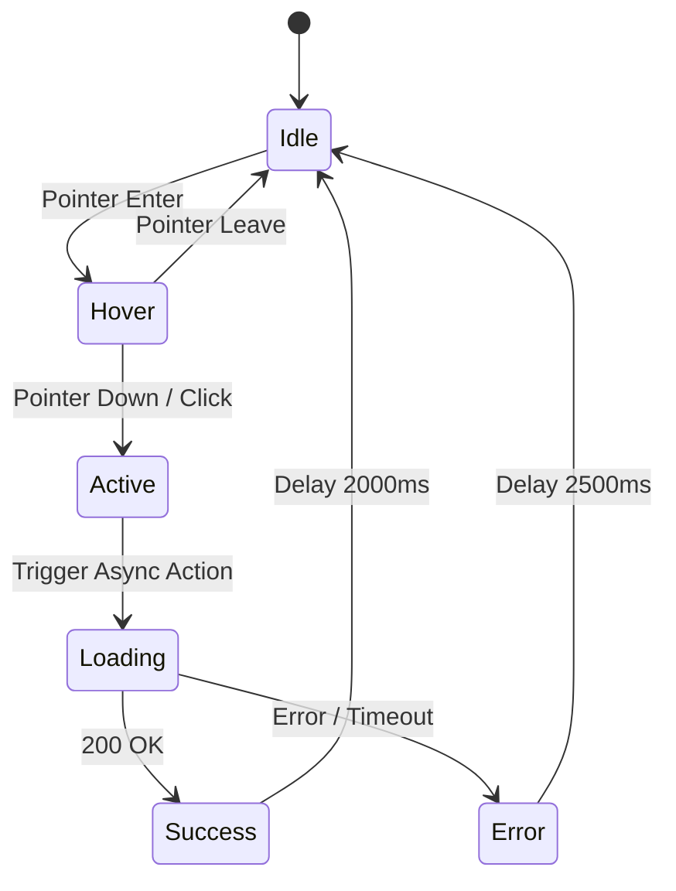

# Trụ Cột 06: Máy Trạng Thái Tương Tác & Chuyển Động Theo Sự Kiện (Interactive State Machines)

Animation trong ứng dụng thực tế không chỉ chạy một lần rồi dừng. Chúng tồn tại trong các máy trạng thái tương tác phức tạp phản hồi lại hành vi người dùng (Hover, Tap, Drag, Scroll, Network States).

---

## 1. Mô Hình State Machine Cho Micro-Interactions

Một icon nút bấm tương tác (ví dụ: nút Download hoặc Submit) có 6 trạng thái cơ bản:



### Triển Khai Bằng CSS Data-Attributes
Thay vì thao tác trực tiếp với DOM style bằng JS, gán trạng thái qua thuộc tính `data-state` để CSS quản lý chuyển tiếp mượt mà:
```css
.interactive-icon[data-state="idle"] #check-mark {
  opacity: 0;
  transform: scale(0.5);
  transition: all 0.2s cubic-bezier(0.4, 0, 0.2, 1);
}

.interactive-icon[data-state="loading"] #spinner {
  opacity: 1;
  animation: spin 1s linear infinite;
}

.interactive-icon[data-state="success"] #check-mark {
  opacity: 1;
  transform: scale(1);
  transition: all 0.3s cubic-bezier(0.34, 1.56, 0.64, 1);
}
```

---

## 2. Scroll-Driven SVG Animation (CSS ScrollTimeline)

Chuẩn CSS hiện đại cho phép kết nối tiến độ cuộn trang (Scroll Progress) trực tiếp vào timeline chuyển động của SVG mà không tốn một dòng code JS, chạy trực tiếp trên Compositor Thread:

```css
@keyframes draw-illustration-path {
  from {
    stroke-dashoffset: 1000;
  }
  to {
    stroke-dashoffset: 0;
  }
}

.scroll-svg-path {
  stroke-dasharray: 1000;
  animation: draw-illustration-path linear;
  animation-timeline: view();
  animation-range: entry 0% cover 50%;
}
```

- **`view()` timeline**: Tiến độ tính từ lúc phần tử bắt đầu tiến vào viewport (entry 0%) đến khi nó rời khỏi hoặc nằm trọn giữa màn hình (cover 50%).
- **Ưu điểm vượt trội**: Không bị ảnh hưởng bởi nghẽn JS Main Thread; khi người dùng cuộn giật cục hoặc vuốt nhanh trên điện thoại, đường vẽ vector vẫn mượt mà ở tần số quét màn hình tối đa.
